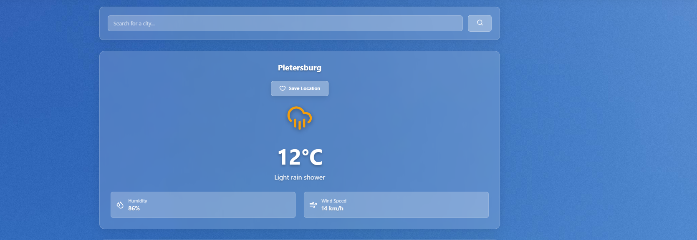

# Weather App

A React and TypeScript weather application for checking current conditions, exploring hourly and daily forecasts, and saving favourite locations. Built as part of the mLab ReactTS weather app assignment.

## Project overview

The Weather App helps users check the weather for their current location or a city they search for. Users can switch between forecast views, choose Celsius or Fahrenheit, change the theme, and save locations for later.

This project develops practical skills in:

- consuming third-party APIs with the browser Fetch API;
- building reusable React components with typed props;
- managing state, effects, and custom hooks;
- sharing theme settings through React Context;
- persisting preferences and saved locations with localStorage;
- debugging TypeScript and ESLint errors;
- styling components with CSS Modules.

## Use-case scenario

Suppose you are planning a day out:

1. Open the app and allow location access to request local weather, or search for a city manually.
2. Check the temperature, humidity, wind speed, and feels-like temperature.
3. Switch between hourly and daily forecasts to plan your activities.
4. Save the location to your favourites.
5. Select another saved location to compare conditions.
6. Choose your preferred theme and temperature unit. These settings remain saved in the same browser.

## Core features

| Feature | Purpose |
| --- | --- |
| Current weather | Show temperature, conditions, humidity, wind speed, and other available details |
| Location detection | Request weather using browser geolocation when permission is granted |
| City search | Search for locations through WeatherAPI.com |
| Hourly forecast | Display hourly forecast entries returned and selected by the app |
| Daily forecast | Display daily forecast entries available from the API |
| Forecast toggle | Switch between hourly and daily views |
| Saved locations | Save, select, and delete favourite locations |
| Theme selection | Switch between light and dark themes |
| Temperature units | Switch between Celsius and Fahrenheit |
| Local persistence | Store saved locations, theme, and temperature unit in localStorage |
| In-app feedback | Show loading states, request errors, and messages for saving favourites |

Severe-weather push notifications and offline weather caching are planned requirements, not completed features. The existing weather-alert component still needs end-to-end integration.

## Weather data structure

The API service converts provider responses into objects used by the UI. An illustrative current-weather object is:

```json
{
  "location": "Pretoria",
  "country": "South Africa",
  "temperature": 24,
  "condition": "Partly cloudy",
  "humidity": 48,
  "windSpeed": 12,
  "feelsLike": 25,
  "pressure": 1015,
  "visibility": 10,
  "alerts": []
}
```

These values are examples, not a live forecast.

| Field | Type | Meaning |
| --- | --- | --- |
| `location` | string | Location name |
| `country` | optional string | Country name |
| `temperature` | number | Temperature in Celsius before display conversion |
| `condition` | string | Weather description |
| `humidity` | number | Relative humidity percentage |
| `windSpeed` | number | Wind speed in kilometres per hour |
| `feelsLike` | number | Feels-like temperature in Celsius before display conversion |
| `pressure` | optional number | Pressure in millibars |
| `visibility` | optional number | Visibility in kilometres |
| `alerts` | optional array | Weather-alert objects for the alert component |

## Current project status

The checklist reflects implementation in the source code; it does not claim that every feature has passed browser testing.

- [x] Set up React, TypeScript, and Vite.
- [x] Create reusable UI and weather components.
- [x] Connect location search and weather requests to WeatherAPI.com.
- [x] Request browser geolocation.
- [x] Add hourly and daily forecast views.
- [x] Save, select, and delete favourite locations.
- [x] Persist theme and temperature-unit preferences.
- [x] Add in-app feedback and loading states.
- [ ] Resolve the remaining theme Fast Refresh lint error.
- [ ] Complete severe-weather alert fetching and dismissal.
- [ ] Implement severe-weather push notifications.
- [ ] Cache weather data for offline viewing.
- [ ] Persist and restore the last active location.
- [ ] Complete responsive and accessibility checks.
- [ ] Verify the production build and all user flows before submission.

## Task breakdown

### Sprint 1: Project setup and interface

- Configure React, TypeScript, Vite, and ESLint.
- Create the header, body, footer, and reusable controls.
- Style the interface with CSS Modules and global styles.


### Sprint 2: Weather and location data

- Define weather and API response types.
- Implement location search and browser geolocation.
- Convert API responses into data for the weather components.
- Provide hourly and daily forecast views.



### Sprint 3: Preferences and saved locations

- Save and remove favourite locations.
- Persist preferences with localStorage.
- Add theme and temperature-unit controls.
- Provide feedback after user actions.

### Sprint 4: Debugging and completion

- Resolve lint errors and verify the TypeScript build.
- Review duplicate requests and location-switching behaviour.
- Complete alerts, offline caching, and last-location restoration.
- Test required screen sizes and prepare the GitHub submission.

## Technologies used

| Technology | Role |
| --- | --- |
| React 19 | Component-based interface and state management |
| TypeScript | Types for props, application data, and API mappings |
| Vite 8 | Development server and production bundling |
| Fetch API | HTTP requests to WeatherAPI.com |
| WeatherAPI.com | Location search, current conditions, and forecasts |
| CSS Modules and CSS | Component and application styling |
| Lucide React | Interface icons |
| React Context | Shared theme state |
| Browser Geolocation API | Permission-based location detection |
| localStorage | Browser-local persistence |
| ESLint | Static code checks |

Axios and React Router DOM are installed dependencies, but the current weather service uses Fetch and the main app does not configure routes.

## Project structure

```text
the-weather-app/
|-- public/
|-- src/
|   |-- assets/
|   |-- components/
|   |   |-- body/
|   |   |   |-- CurrentWeather/
|   |   |   |-- Forecast/
|   |   |   |-- LocationList/
|   |   |   `-- WeatherAlerts/
|   |   |-- header/
|   |   |-- footer/
|   |   `-- ui/
|   |       |-- button/
|   |       |-- notification/
|   |       |-- searchBar/
|   |       `-- textInput/
|   |-- context/
|   |   `-- ThemeContext.tsx
|   |-- hooks/
|   |   |-- useGeolocation.ts
|   |   |-- useLocalStorage.ts
|   |   |-- useNotification.ts
|   |   `-- useWeather.ts
|   |-- services/
|   |   `-- weatherAPI.ts
|   |-- types/
|   |   `-- weather.types.ts
|   |-- utils/
|   |   `-- unitConverter.ts
|   |-- App.tsx
|   |-- App.css
|   |-- index.css
|   `-- main.tsx
|-- index.html
|-- package.json
|-- package-lock.json
|-- eslint.config.js
|-- tsconfig.json
|-- tsconfig.app.json
|-- tsconfig.node.json
|-- vite.config.ts
`-- README.md
```

## Requirements

- A Node.js version compatible with the Vite version in `package-lock.json`.
- npm, included with Node.js.
- Git to clone the repository.
- A modern browser and an internet connection for weather requests.
- A valid WeatherAPI.com API key with access to the required endpoints.

Check your installation:

```bash
node --version
npm --version
git --version
```

## Installation

1. Clone the repository and enter the project folder:

```bash
git clone https://github.com/Kgwale-NN/the-weather-app.git
cd the-weather-app
```

2. Install the dependencies from the lockfile:

```bash
npm ci
```

3. Configure access to WeatherAPI.com.

The current implementation reads an `API_KEY` constant in `src/services/weatherAPI.ts`. It does not yet read an environment variable. Use your own valid key for local development and do not commit a replacement credential. An `.env` file alone will not configure the current code.

The existing client-side key is visible to browser users. Before public deployment, review credential handling and rotate any exposed key. A server-side proxy is needed if the provider credential must remain private; frontend environment variables do not make it secret.

4. Start the development server:

```bash
npm run dev
```

Open the local URL printed in the terminal, commonly `http://localhost:5173`. Vite may choose another port if that port is occupied. Press `Ctrl + C` to stop the server.

## Available scripts

| Command | Purpose |
| --- | --- |
| `npm run dev` | Start the Vite development server |
| `npm run lint` | Check the source with ESLint |
| `npm run build` | Run the TypeScript build checks and generate production files in `dist/` |
| `npm run preview` | Preview an existing production build locally |

There is currently no automated test script in `package.json`.

## Using the app

1. Open the development URL in your browser.
2. Allow location access, or enter a city in the search bar.
3. Review the current weather details.
4. Use the Hourly and Daily buttons to switch forecast views.
5. Save a location to favourites and select it again from the saved-location list.
6. Remove locations you no longer need.
7. Use the header controls to change the theme and temperature unit.

## API integration

The app uses [WeatherAPI.com](https://www.weatherapi.com/), not OpenWeatherMap. Request code lives in `src/services/weatherAPI.ts`.

| Provider endpoint | Current use |
| --- | --- |
| `/search.json` | Search for matching locations |
| `/current.json` | Retrieve current conditions using a location name or coordinates |
| `/forecast.json` | Retrieve hourly or daily forecasts |

Forecast availability depends on the provider response and account access. The current hourly implementation selects entries from the first forecast day, so it does not guarantee a full rolling 24-hour forecast. Alert integration remains unfinished.

## Local storage and privacy

| Storage key | Stored value |
| --- | --- |
| `locations` | Saved location names and countries |
| `theme` | `light` or `dark` |
| `unit` | `celsius` or `fahrenheit` |

Saved information belongs to the current browser and origin; it is not synced across devices. Clearing site data removes these values. Current weather and forecast responses are not cached for offline access.

Geolocation requires browser permission. Searches and coordinates used to retrieve weather are sent to the external weather provider. The app has no user-account system or application database.

## Testing and debugging

Run the static checks independently:

```bash
npm run lint
npm run build
```

The remaining reported lint issue is the mixed provider and hook exports in `ThemeContext.tsx`; that fix is currently deferred. Passing a build does not prove that live API requests or browser interactions work.

Use this manual test checklist:

- [ ] Search for a valid city and verify the displayed location.
- [ ] Search for an invalid location and check the error feedback.
- [ ] Allow and deny location permission in separate tests.
- [ ] Switch between hourly and daily forecasts.
- [ ] Change locations while viewing a forecast and check for stale data.
- [ ] Toggle Celsius and Fahrenheit and check displayed temperatures.
- [ ] Toggle the theme and reload to check persistence.
- [ ] Save, select, and delete a favourite; reload to check persistence.
- [ ] Disconnect the network and check request-failure behaviour.
- [ ] Check keyboard navigation and visible focus on interactive controls.
- [ ] Test widths of 320, 480, 768, 1024, and 1200 pixels for overflow and usability.

In browser developer tools, use the Console for runtime errors, Network for failed or duplicate requests, and Application/Storage to inspect localStorage. Fix one issue at a time, rerun the relevant checks, and review the diff before committing.

## Common problems

| Problem | What to check |
| --- | --- |
| `vite` is not recognized | Install dependencies in the project directory with `npm ci` |
| `Missing script: i` | Use `npm i` to install dependencies; `npm run i` looks for a script named `i` |
| Weather does not load | Check the network request, API key, provider response, and account limits |
| Location is unavailable | Check browser permission and use manual city search |
| Lint reports a problem | Follow the file path, line number, and rule name; rerun lint after the fix |
| Preferences disappear | Check whether site data was cleared or a different browser/origin is being used |

## Production build and deployment

Generate and preview the production build:

```bash
npm run build
npm run preview
```

For a static hosting service, use `npm run build` as the build command and `dist` as the output directory. Test the deployed version separately, including location permission and live weather requests.

The previous project README lists [this Vercel deployment](https://the-weather-app-2ir3.vercel.app). Its availability and deployed version have not been verified for this README.

## Important limitations and next steps

- Resolve the deferred Fast Refresh lint error in the theme context file.
- Complete weather-alert fetching, dismissal, and push notifications.
- Implement offline weather caching and clear stale-data indicators.
- Persist the last active location, in addition to explicitly saved favourites.
- Review duplicate requests and ensure older responses cannot overwrite newer searches.
- Improve forecast handling across midnight and location time zones.
- Validate external API responses at runtime; TypeScript annotations alone do not validate JSON.
- Review client-side API credential handling before public deployment.
- Complete the manual test checklist before treating the assignment as finished.

## Author

Created by **Kgwale-NN** as an mLab React and TypeScript learning project.

[GitHub repository](https://github.com/Kgwale-NN/the-weather-app)

## License

This project is intended for educational use. No specific software license is declared in this README. Add a `LICENSE` file if you choose to publish the project under an explicit license.
